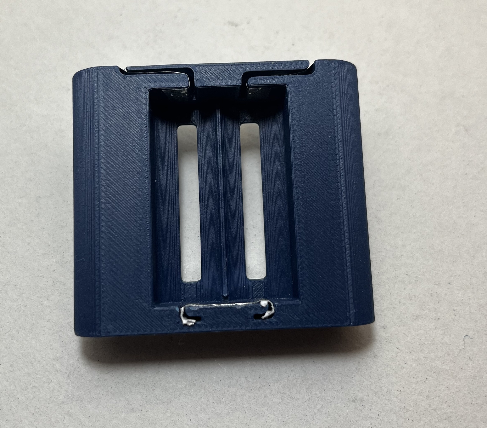
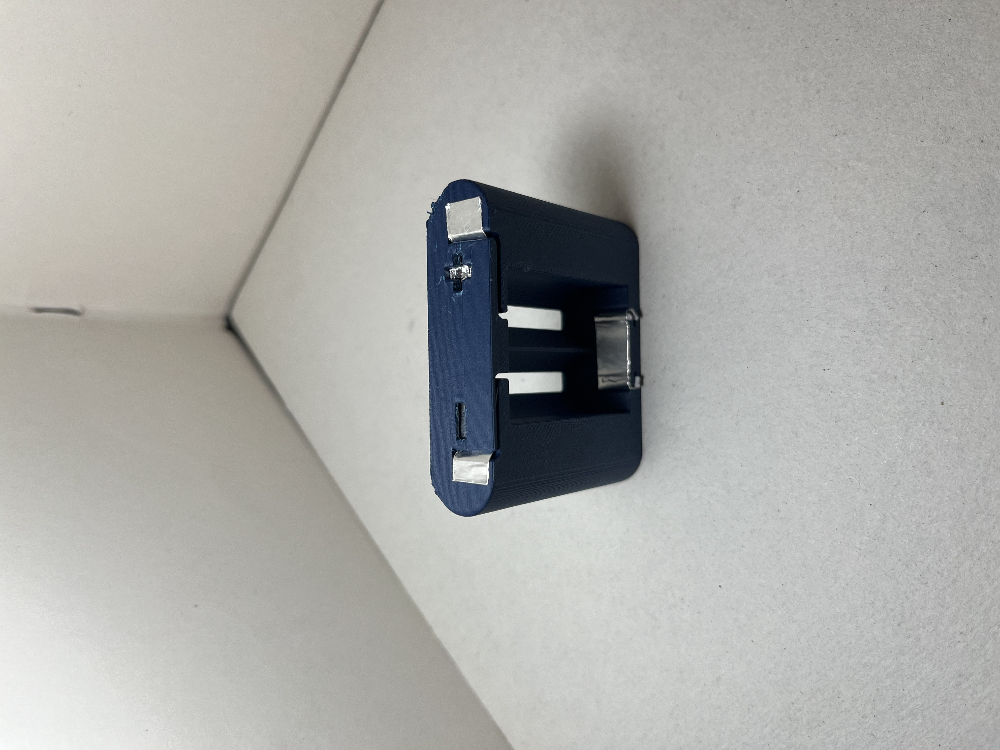
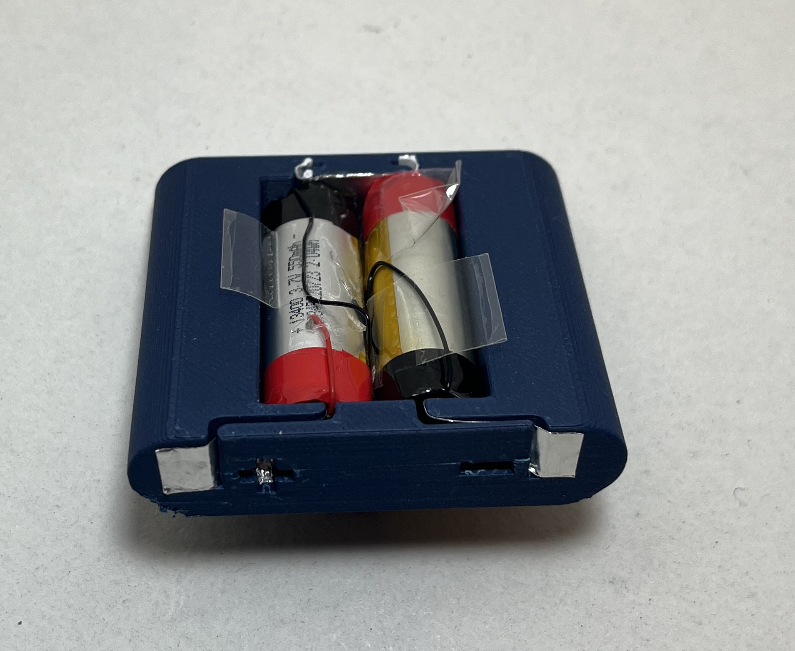
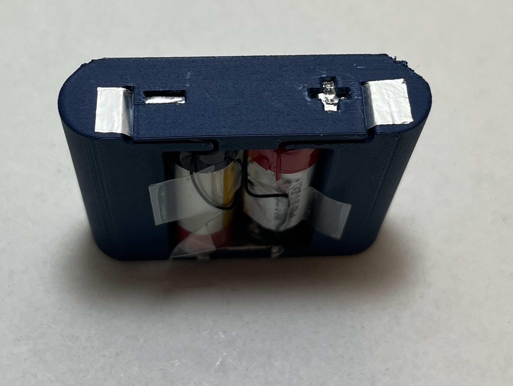

# AA_battery_Adapter
This project aims to create an adapter for a group of 4x1.5V AA alcaline batteries using a couple of salvaged cells from disposable e-cigs.

## Necessity
All starts from this vintage, miniaturized electric sewing machine that I found online. For it to work there's the need of 4x1.5V AA alcaline batteries. This is not a big problem, it's enough just to buy 4 batteries. However I personally find it such a short term power solution. In fact as I could eperience, the power drainage is quite consistent from this device. 
  1. 
    2. 

  So I happen to have, from another <a src="https://github.com/LobinArcolungo/puff_regharge">project</a>, some rechargeable lithium cells. Their capacity is rather small: 500mAh but the voltage is around 3.7V but ranges between 4.2V when fully charges to 3.5V. So with a couple of these cells I can easily reach the target voltage of 6V with some margin which could be cut with a resistor.
 

## Solution
I designed therefore an adapter which holds two of these cells and fits in the sewing machine socket whith minimal components: 
<li> A conductive tape to cut small pieces to do the connections
</li>

<li> A 3D printer of any sort to print the adapter (in my case a Bambulab A1 mini)
</li>

  As can be seen there are some grooves. These groves hold pieces of conductive tape in order to preform the connection on the bottom and to connect the cells to the sewing machine contacts on the top
 

## Assembly
The assembly is rather simple. Just mind the positive and negative position of the cells!

 1.  Insert the cells in alternate polarity to ensure continuity of the current, and again, mind the right orientation!
 

 2.  I put a paper piece in front of the cells to easen the sliding inside the sewing machine and preventing flying cables of batteries to not mess around inside the socket, even though they are secured to the shaft of the cells with some tape.
  

 3. The last step is to put the adapter inside the sewing machine. In your case I hope the socket will work with your setting!
 